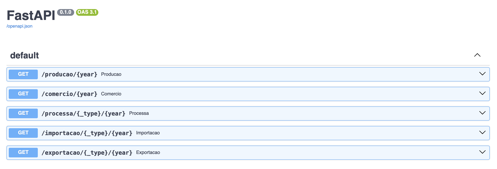

# Embrapa API

## Required technologies

* [Python] - Python in version >= 3.7.4
* [SQLite3] - Database
* [FastAPI] - Web Python lib
* [UV] - uv is and extremely fast Python package and resolver.
* [Pip] - Simple python packager manager
#

## Clone project

```sh
$ git clone https://github.com/luigus/embrapa-api.git
```

#
## Setup project
#### Using pip and virtualenv
```sh
$ cd embrapa-api/
$ python -m venv .venv -p python3.7
$ source .venv/bin/activate
$ pip install --upgrade pip
$ pip install uv
$ uv pip install -r requirements.txt
```

#
## Database
#### Database already have all data from Embrapa inside the tables
If you want to check the table names, please, run this SQL query command below:

```sh
$ SELECT name FROM sqlite_master WHERE type='table';
```

* Tables starts with Imp (means Importacao)
* Tables starts with Exp (means Exportacao)
* Tables starts with Processa (means Processamento)
#
### List of tables inside database
| name 			   
| ------ 			 			
| Producao
| Comercio
| ProcessaViniferas
| ProcessaSemclass
| ProcessaMesa
| ProcessaAmericanas
| ImpVinhos
| ImpSuco
| ImpPassas
| ImpFrescas
| ImpEspumantes
| ExpVinho
| ExpUva
| ExpSuco
| ExpEspumantes


#
## Build and Run FastAPI Web App
#### You need Docker and docker-compose environment enabled
```sh
$ docker-compose build
```

#### To run the application
```sh
$ docker-compose up
```

#
## Run FastAPI Web App in Local
#### You need to have the environment enabled
```sh
$ cd embrapa-api/
$ python -m uvicorn main:app --reload
```

#### The following list of links will be available after the project starts
* http://localhost:8000/docs
* http://localhost:8000/api/producao/{year}
* http://localhost:8000/api/comercio/{year}
* http://localhost:8000/api/processa/{type}/{year}
* http://localhost:8000/api/importacao/{type}/{year}
* http://localhost:8000/api/exportacao/{type}/{year}

#{year} could be beetween 1970 and 2023


## API
| INFO 				   | METHOD 	| ENDPOINTS 				| Type   			 
| ------ 			   | ------ 	|------ 			   		|------
| Producao     		   | GET 		| api/producao/{year} 	        | 
| Comercio             | GET 		| api/comercio/{year} 	        |
| Processamento        | GET 		| api/processa/{type}/{year}    | mesa, americanas, viniferas, semclasse
| Importacao           | GET 		| api/importacao/{type}/{year}  | suco, passas, vinho, frescas, espumantes
| Exportacao           | GET 		| api/exportacao/{type}/{year}  | suco, uva, espumantes
#

## Endpoints
* http://localhost:8000/docs


#

* http://localhost:8000/api/producao/2020
```
[
	{
		"id": 1,
		"control": "VINHO DE MESA",
		"produto": "VINHO DE MESA",
		"quantidade(L)": 124200414
	},
	{
		"id": 2,
		"control": "vm_Tinto",
		"produto": "Tinto",
		"quantidade(L)": 103916391
	},
    ....
]
```

#
* http://localhost:8000/api/comercio/2019
```
[
	{
		"id": 1,
		"control": "VINHO DE MESA",
		"Produto": "VINHO DE MESA",
		"quantidade(L)": 180446489
	},
	{
		"id": 2,
		"control": "vm_Tinto",
		"Produto": "  Tinto",
		"quantidade(L)": 158519218
	},
    ....
]
```

#
* http://localhost:8000/api/processa/mesa/2021
```
[
	{
		"id": 1,
		"control": "TINTAS",
		"cultivar": "TINTAS",
		"quantidade(Kg)": 21732
	},
	{
		"id": 2,
		"control": "ti_ Alphonse Lavallee",
		"cultivar": " Alphonse Lavallee",
		"quantidade(Kg)": 0
	},
	{
		"id": 3,
		"control": "ti_ Moscato de Hamburgo",
		"cultivar": " Moscato de Hamburgo",
		"quantidade(Kg)": 21732
	},
	.....
]
```

#
* http://localhost:8000/api/importacao/suco/2018
```
[
	{
		"Id": 1,
		"País": "Africa do Sul",
		"quantidade(Kg)": 21618,
		"valor (US$)": 18334
	},
	{
		"Id": 2,
		"País": "Alemanha",
		"quantidade(Kg)": 80,
		"valor (US$)": 652
	},
	{
		"Id": 3,
		"País": "Argentina",
		"quantidade(Kg)": 2998,
		"valor (US$)": 3139
	},
	....
]
```

#
* http://localhost:8000/api/exportacao/uva/2017
```
[
	{
		"Id": 1,
		"País": "Africa do Sul",
		"quantidade(kg)": 0,
		"valor (US$)": 0
	},
	{
		"Id": 2,
		"País": "Alemanha, República Democrática",
		"quantidade(kg)": 3353831,
		"valor (US$)": 6730502
	},
	{
		"Id": 3,
		"País": "Angola",
		"quantidade(kg)": 0,
		"valor (US$)": 0
	},
	....
]
```

